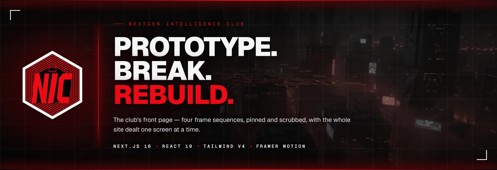
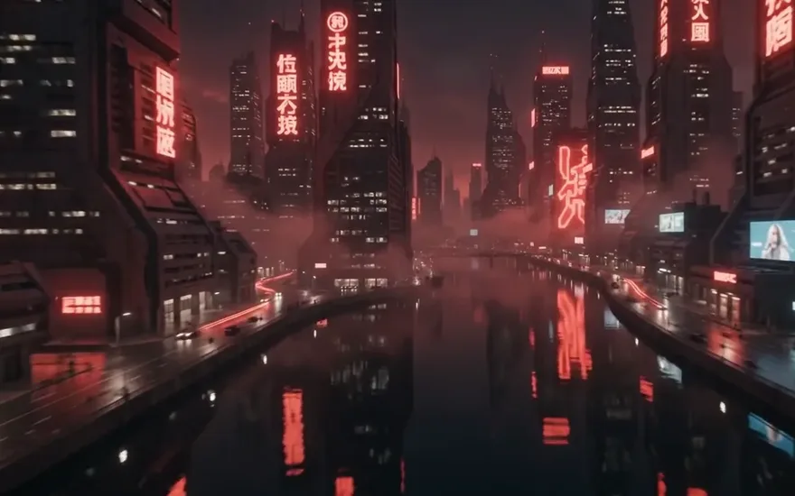
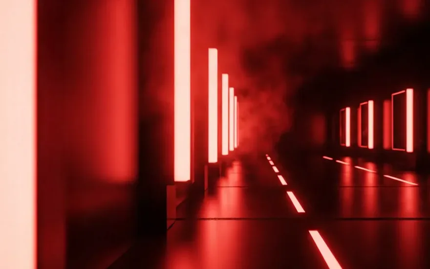
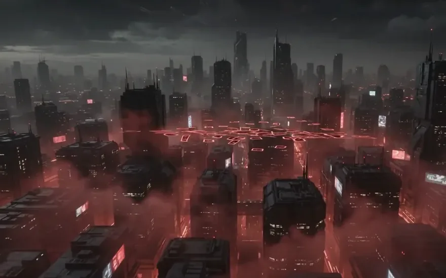

<div align="center">



<br><br>


**The front page of the Nextgen Intelligence Club** — a student-run collective that
prototypes, breaks and rebuilds the future of intelligent systems.

Four frame sequences, pinned and scrubbed against the scroll, with the whole site
dealt one screen at a time.

</div>

---

## The four scenes

Every section of the page is a video sequence exported to WebP stills, preloaded,
and painted to a `<canvas>` at whatever frame the scroll position asks for. Nothing
is a `<video>` — the frames are scrubbed, held, reversed and cross-faded as the
visitor moves, which no video element will do smoothly.

<table>
<tr>
<td width="50%">


**`frames_hexagon` · 240 frames**<br>
The opening. The badge builds itself out of the dark while the loader counts up,
then holds while the club's full name lands.

</td>
<td width="50%">



**`frames_drone` · 240 frames**<br>
A flythrough down a neon canyon, carrying *Meet Us*, *Department* and
*Vision & Mission* over it.

</td>
</tr>
<tr>
<td width="50%">



**`frames_corridor` · 192 frames**
A hall of lit frames — the faculty, then the senior and joint boards, dealt three
seats to a screen.

</td>
<td width="50%">



**`frames_cityskyline` · 240 frames**
A swarm of photographs tumbling through the air, pulling back to the skyline they
were taken over. It carries the visual archive.

</td>
</tr>
</table>

The four sequences **queue rather than race**: each one only starts downloading once
the one ahead of it has landed, so bandwidth always belongs to the frames actually
on screen. About 35 MB in total, fetched strictly in the order it is watched.

---

## Two layouts, one page

This is not one layout at two sizes. It is two layouts, split at 1024px.

|  | **≥ 1024px — a deck** | **< 1024px — a page** |
|---|---|---|
| **Backdrop** | Four sequences, pinned and scrubbed | One still per section, drifting against the scroll |
| **Advancing** | One scroll plays a whole 0.7s push | Sections simply flow past |
| **Rosters** | Three seats to a screen | The whole board in one grid |
| **Frames downloaded** | ~35 MB | **none** |

The sequences are 16:9 and a phone is 9:19.5, so there is no honest way to play one
behind portrait content — `cover` crops the subject away entirely, and the honest
alternative letterboxes the shot into a band across the middle. So the phone gets
one frame instead of two hundred and forty, cropped to fill the screen properly, and
the motion is spent on a parallax drift that survives the format. One still is about
40 KB.

---

## How the deck works

Four layers cooperate. The interesting part is that **the browser stays the source of
truth for scroll position** throughout — so `useScroll`, sticky panels, anchors and
the keyboard all keep working normally.

```
components/smoothScroll.js     wheel input → an inertial ramp (no dependencies)
        │                      the browser still owns scrollY; we only write to it
        ▼
components/useSlideHandoff.js  decides WHEN a finished slide advances, then plays
        │                      the whole push as one uninterruptible tween — and
        │                      replays it in reverse when you scroll back up
        ▼
components/Slide.jsx           one screen of the deck, sitting in normal flow
        │                      above a pinned sequence
        ▼
.pull-up-viewport (-100svh)    drags the next section over the pinned one, so it
                               wipes rather than follows
```

A few consequences worth knowing before editing anything:

- **A slide only advances while it fits in one viewport.** Grow a heading one line
  too tall and the deck quietly stops advancing that slide — which is why type here
  clamps against `vh` as well as `vw`, e.g. `clamp(2.5rem, min(8vw, 11vh), 5.5rem)`.
- **Automatic pushes are opt-in by device.** They require a fine pointer and no
  `prefers-reduced-motion`. Everyone else gets the same travel; they just scroll it
  themselves, and over one viewport a single flick covers it.
- **Frames live in a ref, not in state.** The canvas reads them 60× a second and must
  not drag React through a render each time.
- **`document.body.style.overflow === "hidden"` is the page-wide "hold still" flag.**
  The loader, the mobile sheet and the member dialog all set it; the scroll layer
  checks it before touching anything.

---

## Getting started

```bash
npm install
npm run dev     # http://localhost:3000
```

| Script | What it does |
|---|---|
| `npm run dev` | Development server |
| `npm run build` | Production build — **the check to run before pushing** |
| `npm start` | Serves the production build |

> [!NOTE]
> `npm run lint` is currently broken: the pinned `eslint-config-next` ships no
> `core-web-vitals` entry point, so the flat config fails to resolve. Use
> `npm run build` to verify a change until that is sorted. There is no test suite —
> this is a visual site, and the way to check it is to look at it.

Layout arithmetic here is load-bearing, so when a change touches a pinned section,
check it at **390×844** and **1440×900** (two different layouts), plus a short
landscape window like **844×390** where slides stop fitting the screen. Screenshot a
production build rather than the dev server, which serves stale CSS for newly added
Tailwind utilities.

---

## Project structure

```
app/
  page.jsx              the front page: mounts the four sequences and chains them
  join/page.jsx         the one other route — a server component, for its metadata
  globals.css           Tailwind v4 theme + the svh-based viewport utilities

components/
  HeroSequence/         ┐
  CrewSequence/         │ each section is index.jsx (layout)
  ArchiveSequence/      │ + content.js (every word, name and photo path)
  NicLogoIntro/         ┘
  Slide.jsx             one screen of the deck
  FrameCanvas.jsx       paints the sequence, cross-fading between frames
  SceneStill.jsx        what a pinned sequence becomes on a phone
  smoothScroll.js       the inertial scroll layer
  useSlideHandoff.js    when a slide advances, and how it comes back
  useFrameSequence.js   preloads and thins a sequence per breakpoint
  surfaces.js           PANEL, HEADING_SHADOW, GRAIN_PLATE — shared surfaces
  motionPresets.js      one reveal vocabulary for the whole page
  siteLinks.js          the table of contents, stated once for nav and footer

public/frames/          the four sequences, ~900 WebP stills
public/crew/            board and faculty portraits
```

---

## Editing the content

All copy lives in `content.js` beside the section that renders it — no text is
hard-coded into a component. Several fields are still placeholders, marked in the
source with a `FILL ME IN` block:

- **Member bios** currently describe *the post*, not the person. None of it came from
  a source and none of it is a claim about anyone; they are there so the layout reads
  as finished while the real write-ups are collected.
- **Club social links** in `components/siteLinks.js` are empty. The footer renders
  all four channels either way — a missing one is a dimmed, dead tile rather than a
  gap — so the strip keeps its shape while the handles are gathered.
- **Board term years** are labelled "Current" and "Previous" until someone confirms
  the academic years.

Adding a member is a single entry in the roster array. Two fields are worth reading
the comments for: `photo` (a path under `/public`, and `null` falls back to a
numbered plate rather than breaking the row) and `crop` — an `object-position` pair
measured off each photograph, because the site crops the same portrait into a 4:5
card, a tall plate and a wide band, and one rule cannot serve all three.

---

## Design system


The badge is not an image — it is rebuilt from geometry in
`components/NicLogoMark.jsx`, so it stays sharp at any size and the loading screen
can draw it ring by ring, stroke by stroke.

| Token | Value | |
|---|---|---|
| `nic-red` | `#ed0a14` | Headings, rules, the seam between sections |
| `nic-ember` | `#ff3b3b` | Label-size type, where the brand red goes muddy |
| `nic-bone` | `#f4f4f5` | Body |
| Type | Geist / Geist Mono | Mono is for labels: uppercase, `0.2em`–`0.4em` tracked |

Legibility is bought locally, not globally: the scrims over each sequence only take
the glare off, and every block of running text sits on a `PANEL` of its own that is
as dark as that text actually needs. The sequence stays lit in the gaps between
them, which is where it was always meant to be seen.

---

<div align="center">
<sub>Built for NIC · Recruitment details live at <code>/join</code></sub>
</div>
